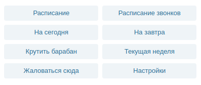

# NAUScheduleBot
@nauSchedulerBot

Суть этого проекта заключалась в том чтобы облегчить мои страдания, 
поскольку для меня вечная проблема помнить какие пары, 
поэтому я решил - пусть за меня помнит кто-то другой :)

Бот имеет основные функции:

1.Регистрация нового пользывателя в системе, все что нужно сделать это указать
название своего факультета, номер группы и подгруппы, после чего будет доступно основное меню

2.Основное меню

3.Настройки, где можно изменить факультет, номер группы и подргруппы + подписаться на уведомления

4.Система уведомлений

Каждый день в 6.30 утра будет приходить уведомления о том какие пары сегодня
, а в 20.30 уведомление какие пары будут завтра.

P.S На данный момент бот не работает, 
поскольку администрация НАУ не удосужилась обновить базу с новым рассписанием. upd 22.10.2020 